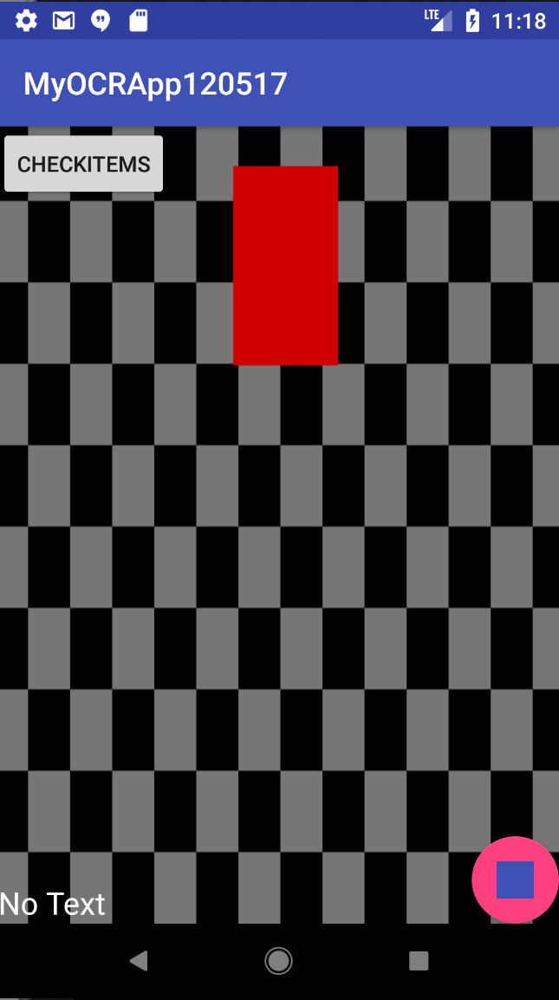

# Android-OcrRecyclerView


<ol>
  <li><code>Play-Services-Vision</code> is an Android Library for <code>Google Mobile Vision API</code>.</li>
  <li>This application implements <code>Text Recognition API</code>.</li>
  <li>Application is designed in a way that user can select multiple texts to remember using <code>Floating Action Button</code>, and put them up for display using <code>RecyclerView</code>.</li>
</ol>
<h2>Simple Usage</h2>
1.) Add the Camera dependency to your build.gradle file.
```xml
    compile 'com.google.android.gms:play-services-vision:11.6.2'
```
2.) Android Manifest
``` xml
    <uses-permission android:name="android.permission.CAMERA"/>

    <meta-data android:name="com.google.android.gms.vision.DEPENDENCIES"
```
3.) Receive Detections
```java

    @Override
    public void receiveDetections(Detector.Detections<TextBlock> detections) {
        final SparseArray<TextBlock> items = detections.getDetectedItems();
        if (items.size() != 0){
            textView.post(new Runnable(){
                @Override
                public void run() {
                    StringBuilder stringBuilder = new StringBuilder();
                    for (int i = 0; i<items.size(); ++i){
                        TextBlock item = items.valueAt(i);
                        stringBuilder.append(item.getValue());
                        stringBuilder.append("\n");
                    }
                    read_text = stringBuilder.toString();
                    textView.setText(read_text);
                }
            });
        }
    }
```
